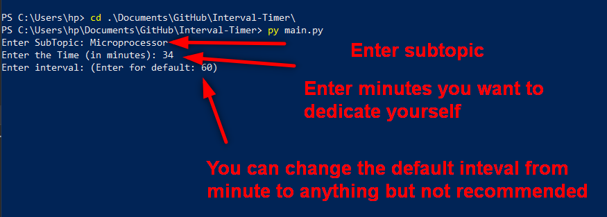

# Interval Timer

## Dependencies
Go to your command and type all these commands
1. `pip install playsound`
2. `pip install datetime`
3. `pip install pandas`
4. `pip install pick`
## Installation
1. Download the zip or copy using `git clone https://github.com/shantanutheone/Interval-Timer.git` to your destined folder in windows if you've installed git.
2. Open cmd or powershell and go to folder where you downloaded or cloned files.

3. Run command `py main.py`

4. Select from Topic or create new one.

5. Now Enter Subtopic and minutes you want your timer to remind you after interval.
