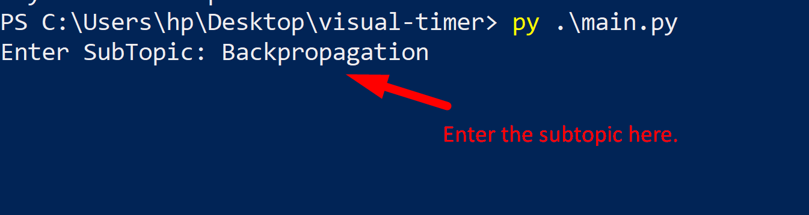
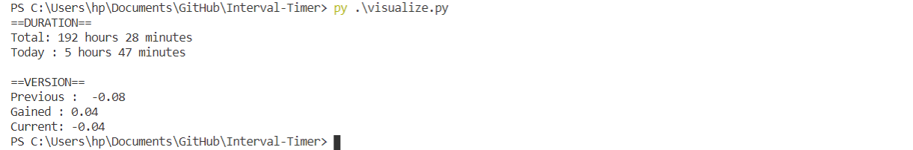
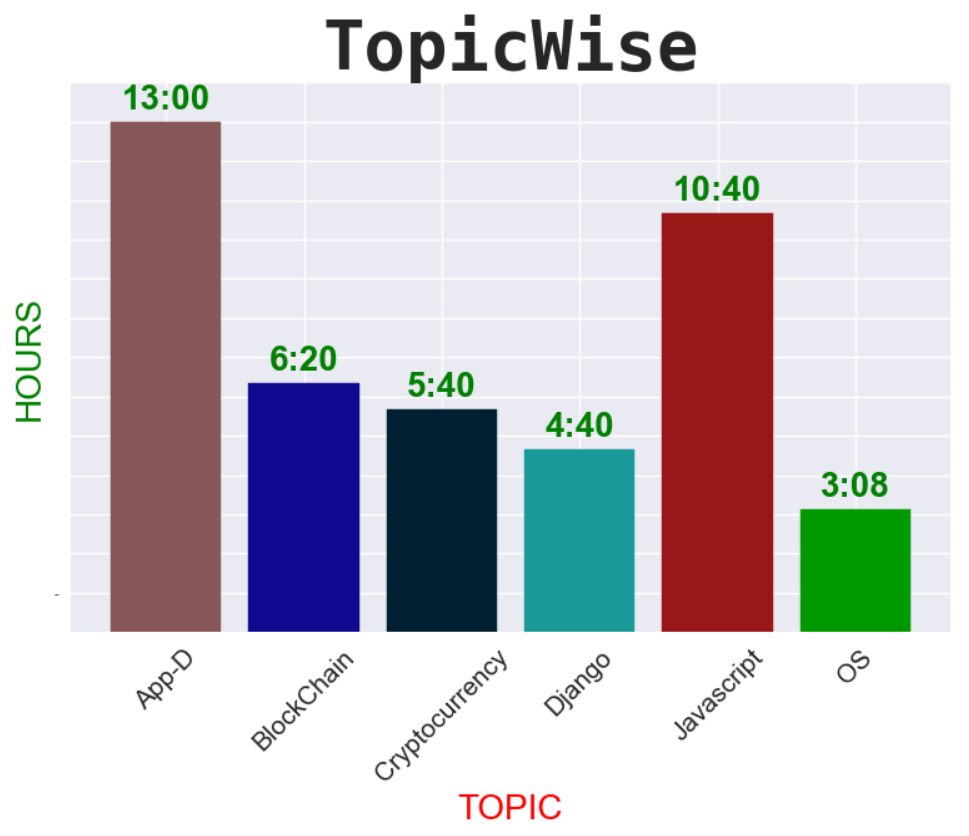
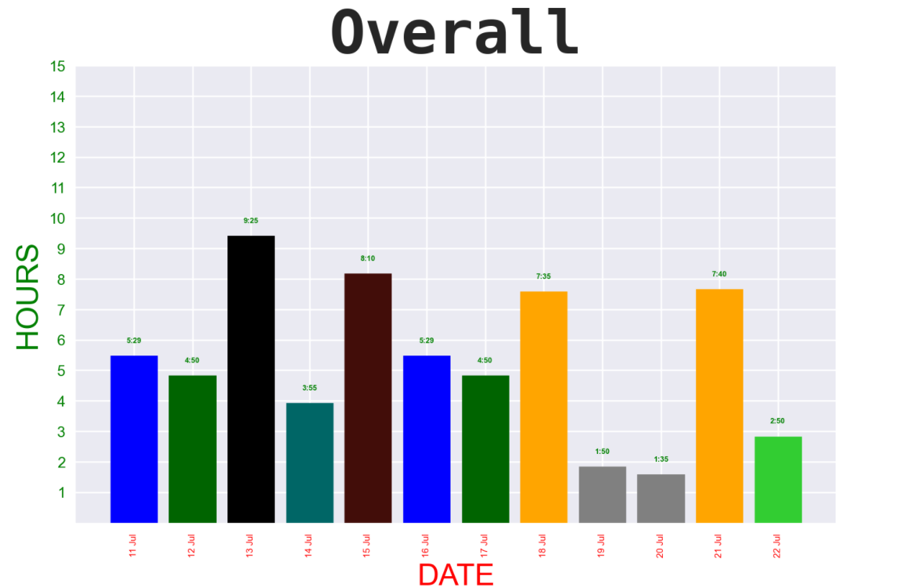
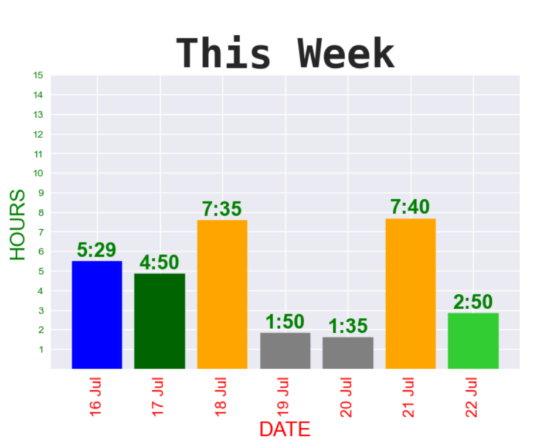
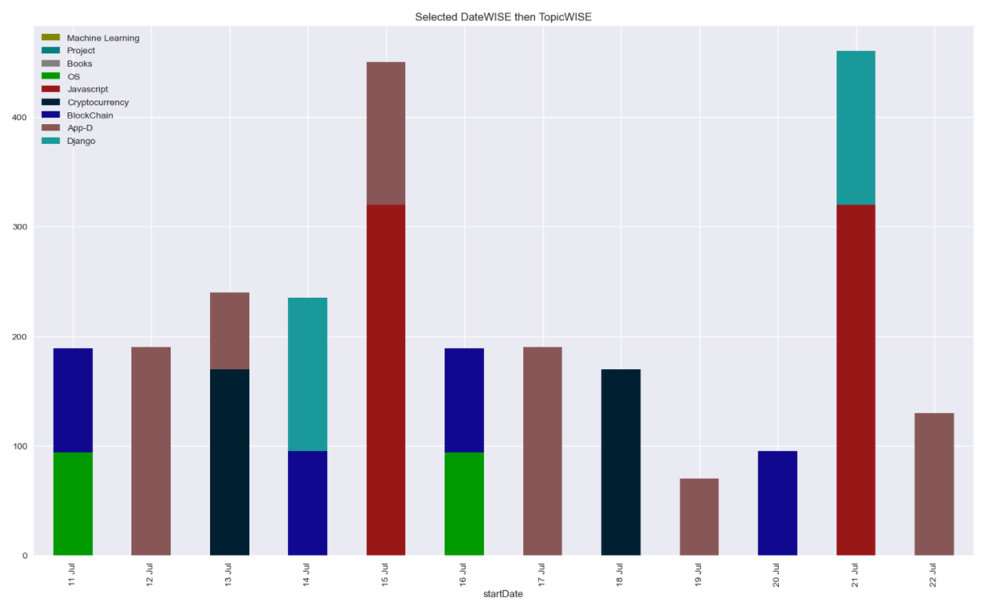
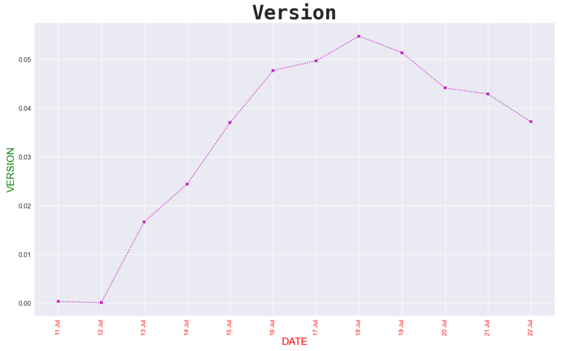

# Interval Timer

## Dependencies
Go to your command and type all these commands
1. `pip install playsound`
2. `pip install datetime`
3. `pip install pandas`
4. `pip install pick`
## Installation
1. Download the zip or copy using `git clone https://github.com/shantanutheone/visual-timer.git` to your destined folder in windows if you've installed git.
2. Open cmd or powershell and go to folder where you downloaded or cloned files.

3. Run command `py main.py`

4. Select from Topic or create new one.

5. Enter the subtopic.
6. 

# Visualization
0. Command to visualize following.

1. Check out Topicwise Hours spend.

2. Check out daily time spend.

3. Check out of only this week.

4. If you want more specifics of a single day this one is for you. 

5. Challenge Mode - Check your version of yourself each day.
